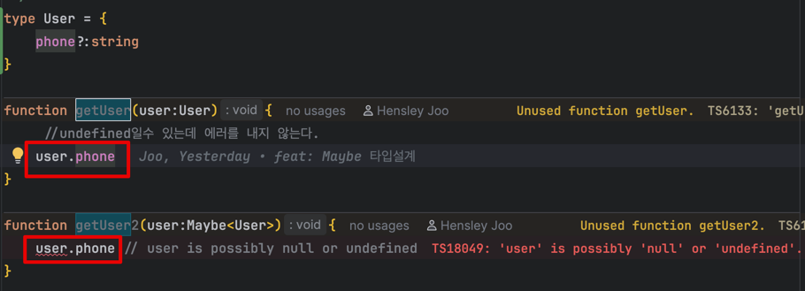

## 타입과 런타임의 간극: 물리적 거리가 만드는 위험

타입 정의는 **약속**이지만, 런타임은 **현실**이다. 그리고 약속과 현실 사이의 거리가 멀수록, 약속은 쉽게 잊혀진다.

OpenAPI (ex: Swagger, Stoplight, etc.) 를 사용하면
서버가 제공하는 API 스펙을 바탕으로 자동으로 TypeScript 타입을 생성해준다.

예를 들어 서버 스펙이 이렇게 있다면:
```yaml
UserResponse:
  type: object
  properties:
  name:
    type: string
    nullable: true
  phone:
    type: string
```

이걸 OpenAPI Generator나 openapi-typescript
같은 도구로 변환하면:
```typescript
export interface UserResponse {
    name?: string | null;
    phone?: string;
}

```
즉, 서버 응답 타입과 클라이언트 타입이 동기화된다. 
그런데 이 타입은 서버스펙 그대로일 뿐이다. 


런타임에서 `phone`은 `undefined`일 수도, 실제 문자열 값일 수도 있다. 이 불확실성은 **타입 정의와 사용처가 물리적으로 멀리 떨어져 있을 때** 더욱 위험해진다.

```tsx
// components/UserProfile.tsx - 수백 줄 떨어진 곳
function UserProfile({ user }: { user: UserResponse }) {
  const phoneLength = user.phone.length  // 💥 런타임 에러!
  // TypeError: Cannot read property 'length' of undefined
}
```
타입시스템이 `phone?:string` 을 허용했지만, 실제 사용처에서는 undefined를 체크를 강제하지 않는다면 런타임 에러는 피할 수 없다.
타입 정의가 멀리 떨어져 있을 수록 개발자는 이 가능성을 놓치지가 쉽다. 

불확실한 데이터를 다룰 때는 타입을 믿되, 검증은 필수다. 특히 타입 정의와 사용처가 멀리 떨어져 있다면, 결국 방어적 코딩이 선택이 아니라 습관이 되어야 한다.

이에 대한 방법중 한가지는 tsconfig.json에서 `strictNullChecks`을 true로 설정해 user.phone에서 length로 체이닝시 undefined에 대한 에러를 잡아 줄 수 있다. 

그런데 Maybe 타입이 있다.Maybe라는 뜻에서 유추할 수 있듯이 제네릭에 들어오는 타입이 있을수도없을수도 있다라고 이해할
수 있다.    

Maybe 타입과 optional은 비슷해 보이는데 쓰임새가 다른걸까? 

```typescript
interface User1 {
  phone?: string  // string | undefined
}

interface User2 {
  phone: Maybe<string>  // string | null | undefined
}


```
여기서의 차이는
User1의 경우 phone필드자체가 존재하지 않을 수도 있다는 전제하에 phone필드가 없어도 타입에러가 나지 않는다.
반면 User2의 경우 phone 필드는 꼭 있어야 하지만 null이나 undefined 가능하다는 전제이다. 

User2에서의 Maybe는 null도 되고 undefined도 가능한데, undefined라면 결국 필드가 없어도 되지 않을까? 도 생각했지만, 
타입스크립트에서 `undefined`는 `optional`의 `프로퍼티가 없다`와 는 다르다.

```typescript
interface User2 {
  phone: Maybe<string>; // string | null | undefined
}

const user: User2 = {
}; 
// ❌ Error: Property 'phone' is missing in type '{}'

```
왜냐하면 TypeScript는 정적 구조적 타입시스템이므로 `phone`이라는 속성 자체가 선언되어야 타입에 맞는것으로 판단하기 때문이다.
즉, undefined라는 값을 가질수는 있지만, 속성자체를 생략할수는 없다. 

반면 optional property의 경우 `?` 타입스크립트는 . 속성이 존재하지 않아도 괜찮다라고 해석한다. 
`phone?:string` 은 속성자체가 생략이 가능하고, `phone: string|null|undefined` 속성은 있어야 하고 값만 undefined가 가능하다.




